# iPlant - Medicinal Plant Application

iPlant is a Flutter-based mobile application that allows users to explore medicinal plants, view detailed information, interact with an AI chatbot, and manage their profiles. The app aims to promote the benefits of medicinal plants by providing recommendations based on user conditions like stress, skincare, and more.

---

## Features

### Core Features
- **User Login**: Secure authentication system for accessing personalized features.
- **Plant Discovery**: Explore medicinal plants with pagination and search capabilities (search by tags or names).
- **Plant Details**: View detailed information about a selected plant, including its uses and benefits.
- **Comment on Plants**: Users can leave comments on specific plants to share experiences or ask questions.
- **Profile Management**: View and update profile information, including uploading a new profile picture.

### AI Chatbot
- **Personalized Recommendations**: AI-powered chatbot to suggest plants based on conditions like stress, skincare, or other health benefits.
- **Additional Resources**: Provides URLs to relevant articles for further reading.

---

## Screenshots

### 1. Login Page
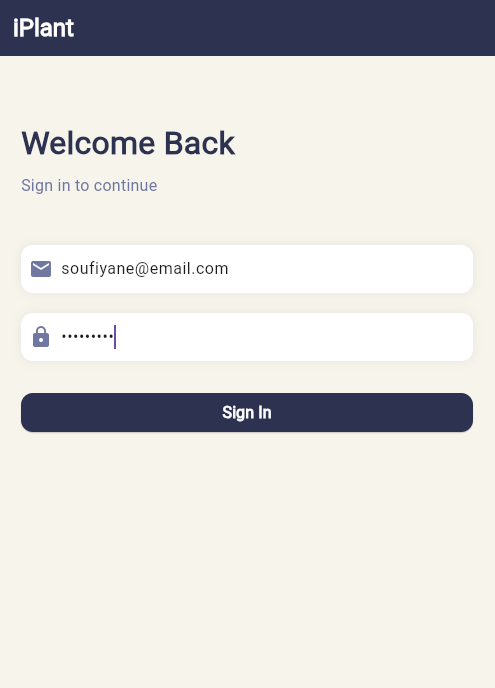

### 2. Home Page
#### Plant List with Pagination
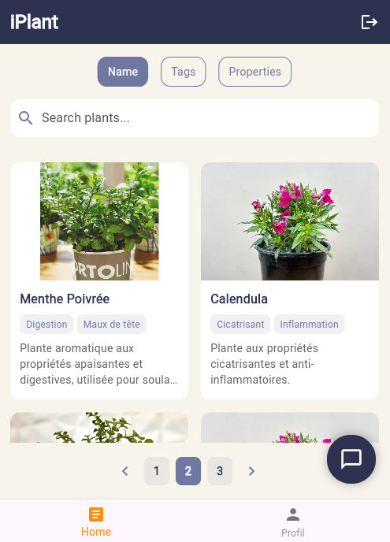

### 3. Plant Details
#### Detailed View of Selected Plant

| 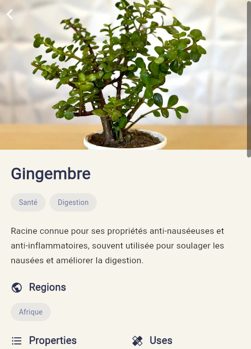 | 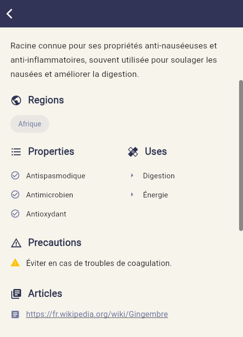 |
|---------------------------------------------|---------------------------------------------|


### 4. Comment on Plant
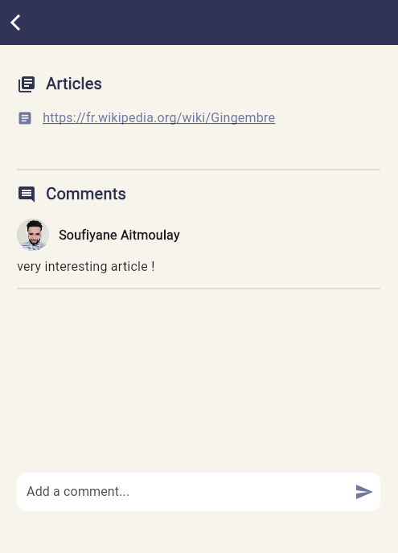

### 5. Profile Page
#### User Profile and Image Update
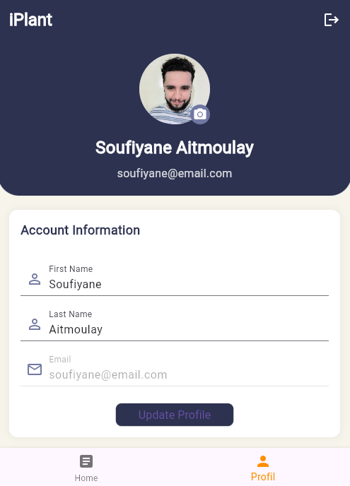

### 6. AI Chatbot
#### Conversations and Recommendations

| 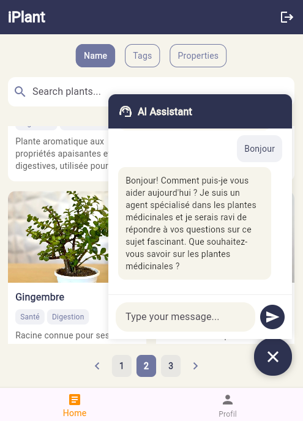 | 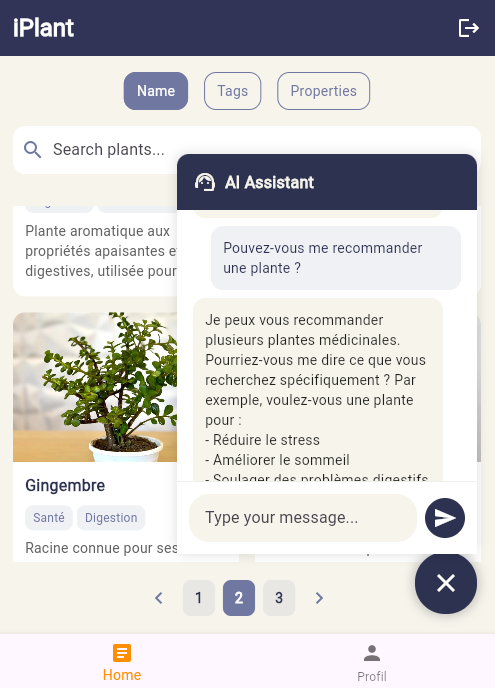 | 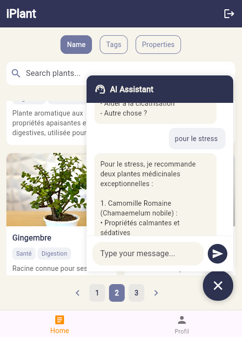 |
|------------------------------------------------------|------------------------------------------------------|------------------------------------------------------|
| 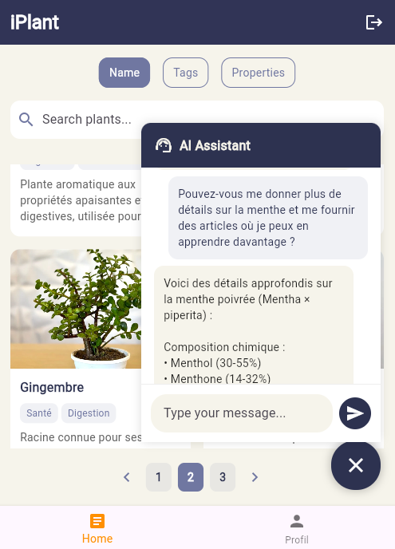 | 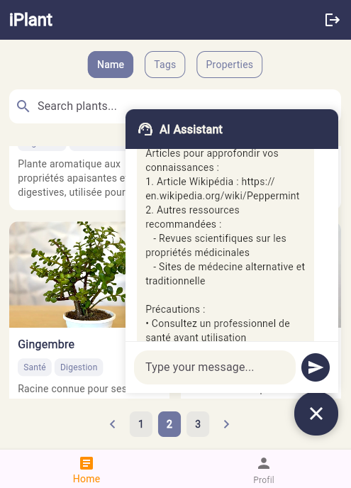 | 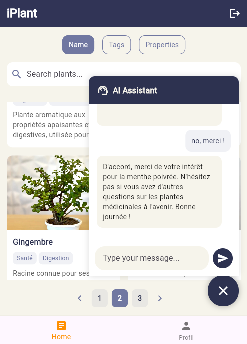 |


### 7. Logout
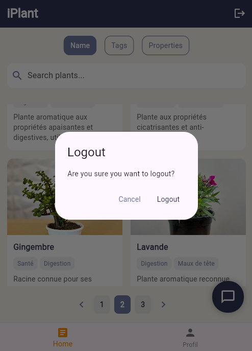

---

## Technical Stack

- **Frontend**: Flutter
- **Backend**: AWS Lambda, API Gateway, and DynamoDB for API and database operations.
- **AI Chatbot**: Powered by a custom-trained AI model for personalized recommendations.

---

## Installation

1. Clone the repository:
   ```bash
   git clone https://github.com/yourusername/iplant.git

2. Navigate to the project directory:
   ```bash
   cd iplant

3. Install dependencies:
   ```bash
   flutter pub get

3. Run the application::
   ```bash
   flutter run

## Usage

1. **Login**: Create an account or log in with existing credentials.
2. **Explore Plants**: Navigate through the home page to discover plants, search, and paginate.
3. **Detailed View**: Click on a plant to view detailed information and leave comments.
4. **AI Chatbot**: Access the chatbot from the home page for plant recommendations based on your conditions.
5. **Profile Management**: Update your profile and upload a new profile picture.
6. **Logout**: Securely log out of the application.

