# Introduction

Bonjour, monsieur ! Je m'appelle Soufiyane AIT MOULAY. Je suis un ingénieur Cloud certifié avec plus de deux ans d'expérience professionnelle en ingénierie cloud. Pour ce projet, j'ai décidé de mettre en œuvre des services cloud au lieu d'utiliser Firebase. J'ai utilisé AWS API Gateway et AWS Lambda pour les API RESTful, DynamoDB comme base de données NoSQL et un bucket S3 pour stocker des images.

# IMPORTANT

Veuillez vous référer à la section des captures d'écran pour les images. Si l'application plante, cela peut être dû à l'arrêt des services AWS afin d'éviter des frais. Merci de lire attentivement la documentation.

## Informations de connexion

Vous pouvez utiliser les identifiants suivants pour vous connecter :

- **Utilisateur 1 :**  
  Email : soufiyane@email.com  
  Mot de passe : soufiyane  

- **Utilisateur 2 :**  
  Email : user2@email.com  
  Mot de passe : user2  

## Captures d'écran

### Écran de connexion

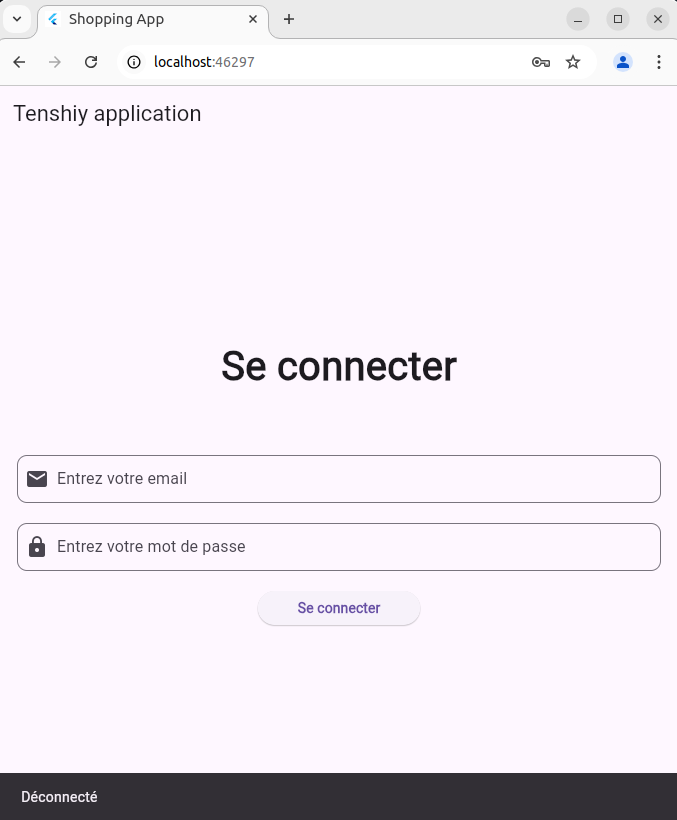

### Page d'accueil

Après vous être connecté, vous serez dirigé vers la page d'accueil où les articles sont affichés.

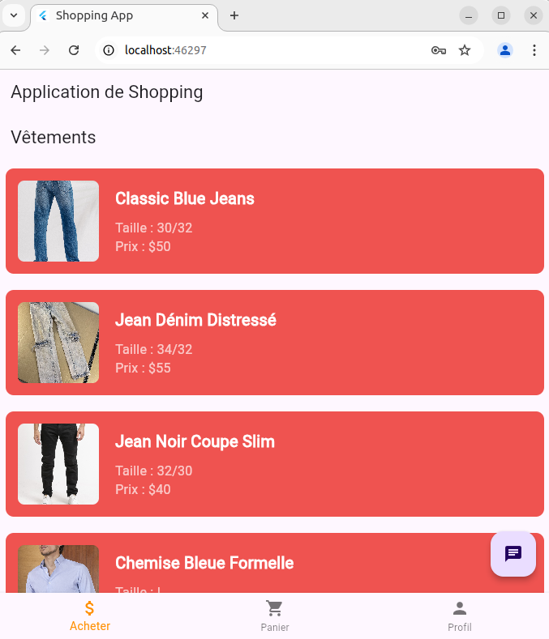

### Détails de l'article

Cliquez sur un article pour voir ses détails et l'ajouter à votre panier.

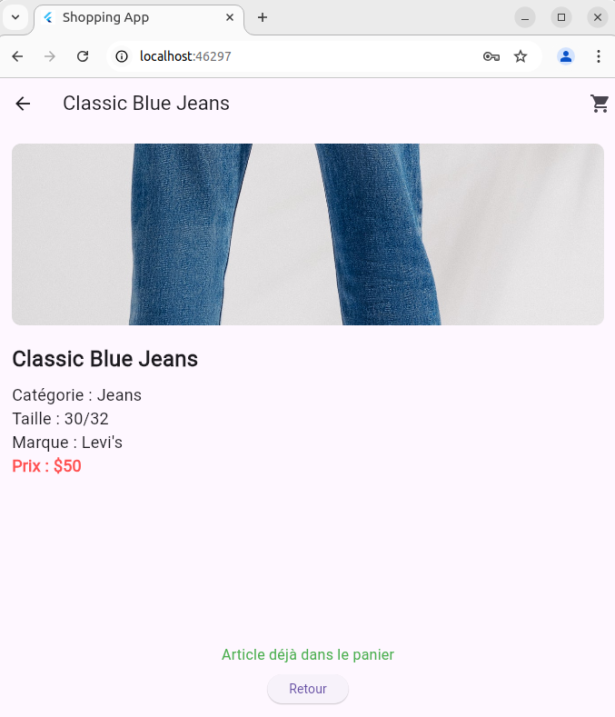
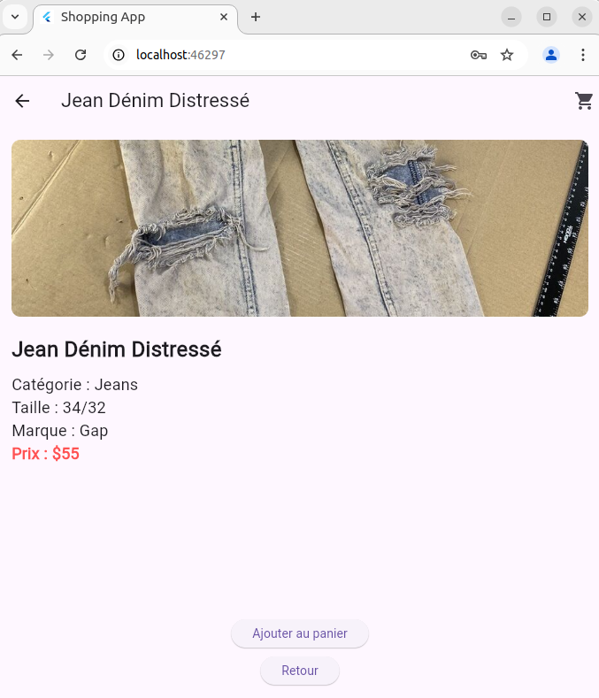

### Page du panier

Après avoir ajouté des articles à votre panier, vous pouvez voir le total sur la page du panier.

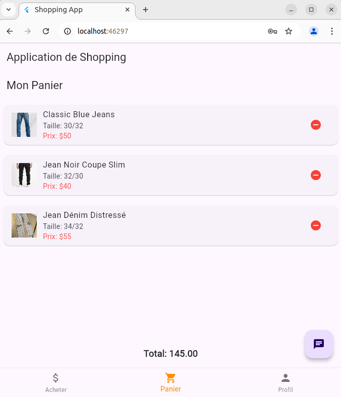

### Page de profil

Voici la page de profil où vous pouvez gérer vos informations.

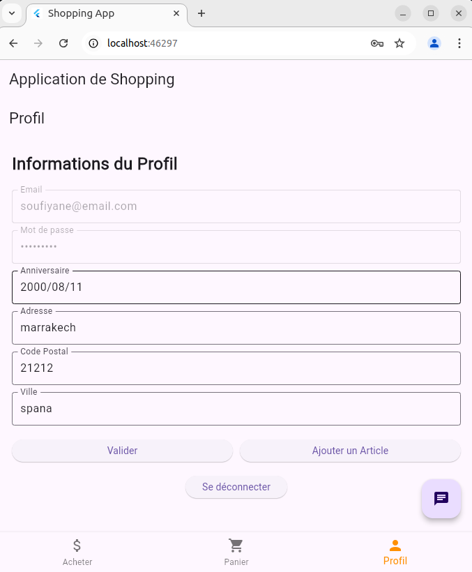

### Page d'ajout d'article

Voici la page d'ajout d'article où vous pouvez soumettre de nouveaux articles.

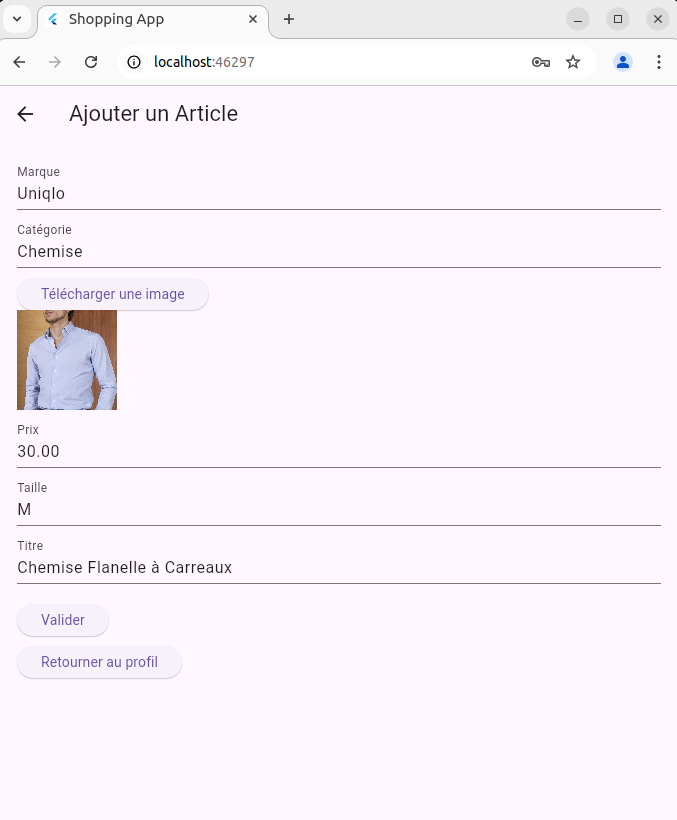

### Intégration de l'IA

J'ai intégré un chatbot pop-up alimenté par l'API GPT, permettant aux utilisateurs de poser n'importe quelle question. Vous n'avez pas spécifié de fonctionnalités précises, et vous avez simplement mentionné que vous souhaitiez voir un peu d'IA. Pour cela, j'ai choisi de faire quelque chose de simple. Bien que j'aurais pu aller un peu plus loin et créer un agent pour aider les utilisateurs à acheter des articles en utilisant des services AWS, j'ai voulu garder cela simple pour ce projet.

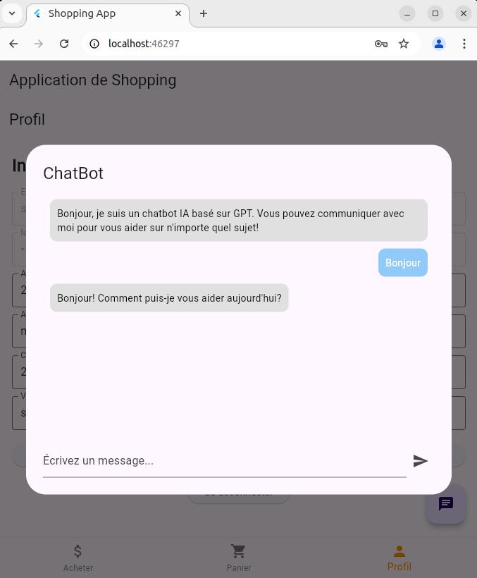

## Services AWS

### AWS Lambda
AWS Lambda est un service de calcul sans serveur qui exécute du code en réponse à des événements et gère automatiquement les ressources de calcul sous-jacentes. Dans ce projet, j'ai utilisé Lambda pour gérer la logique métier de mes API RESTful.

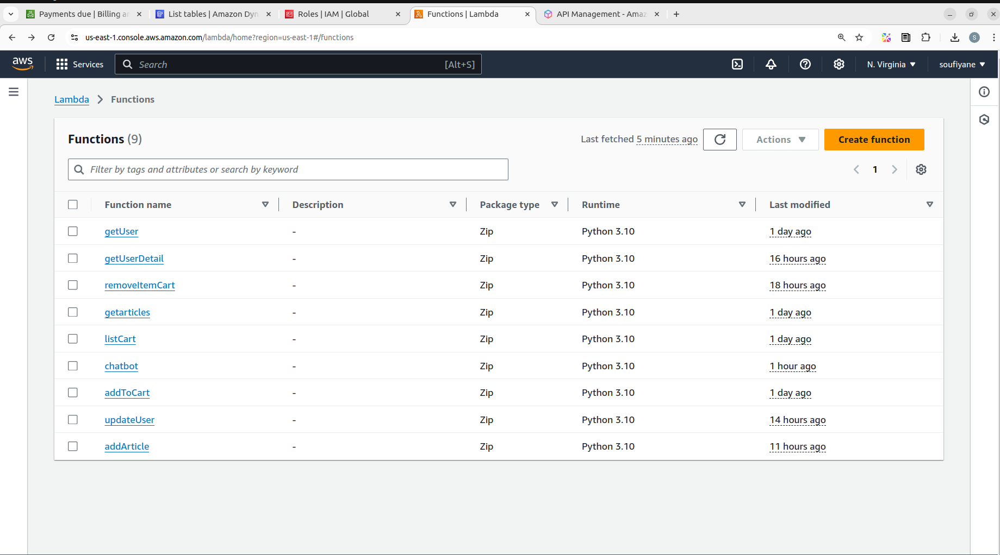

### Amazon API Gateway
Amazon API Gateway est un service qui facilite la création, la publication, la maintenance, la surveillance et la sécurisation d'APIs à n'importe quelle échelle. J'ai utilisé API Gateway pour exposer mes fonctions Lambda sous forme d'APIs RESTful.

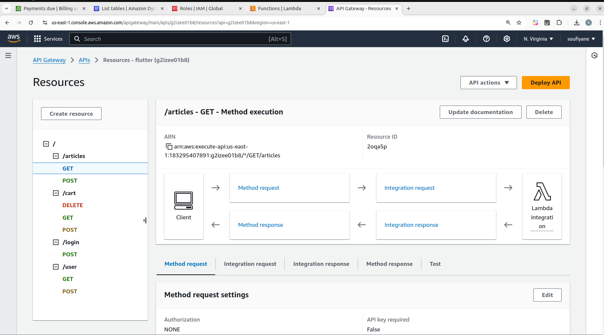

### Amazon DynamoDB
Amazon DynamoDB est une base de données NoSQL entièrement gérée qui offre des performances rapides et prévisibles avec une évolutivité transparente. J'ai utilisé DynamoDB pour stocker les données des articles et des utilisateurs dans ce projet.

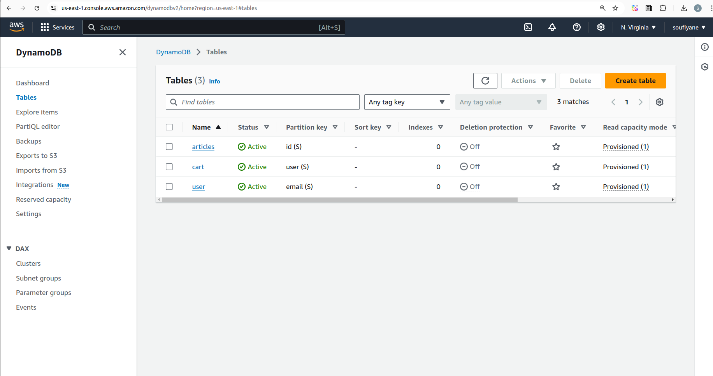

### Amazon S3
Amazon S3 (Simple Storage Service) est un service de stockage d'objets qui offre une scalabilité, une disponibilité et une sécurité élevées. Dans ce projet, j'ai utilisé S3 pour stocker les images des articles.

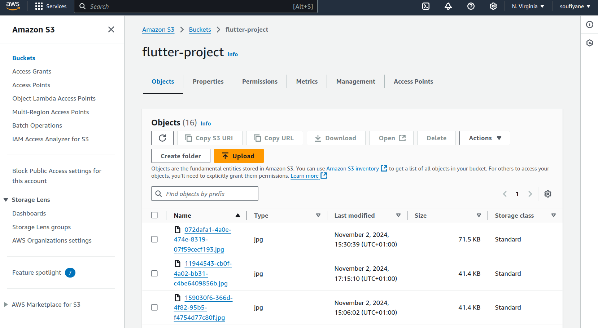

# Contact

Pour toute question, vous pouvez me contacter via LinkedIn : [Soufiyane AIT MOULAY](https://www.linkedin.com/in/soufiiyane/).
